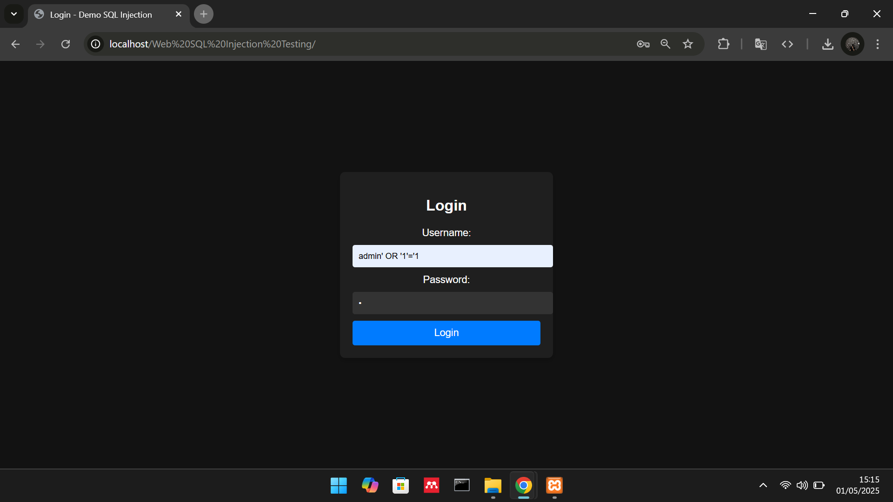
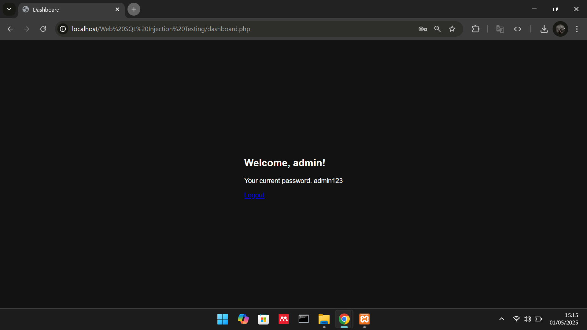

# DemonstrasiSQLInjection

## Apa itu SQL Injection?
SQL Injection adalah teknik serangan siber yang memanfaatkan kerentanan dalam aplikasi web untuk menyisipkan kode SQL berbahaya ke dalam input yang diterima oleh aplikasi. Tujuan serangan ini adalah untuk memanipulasi database, mencuri data sensitif, atau bahkan mengamankan kontrol atas server aplikasi. 

 

| Variable           |             Isi            |
| -------------------|----------------------------|
| **Nama**           |         Fadil Aditya Adzima    |
| **NIM**            |          312310617         |
| **Kelas**          |          TI.23.A.6         |
| **Mata Kuliah**    |      Pemrograman Web 2     |
| **Dosen Pengampu** | Agung Nugroho S.Kom., M.Kom.  |

    

## Hasil Demonstrasi SQL Injection
 

    

 

    
